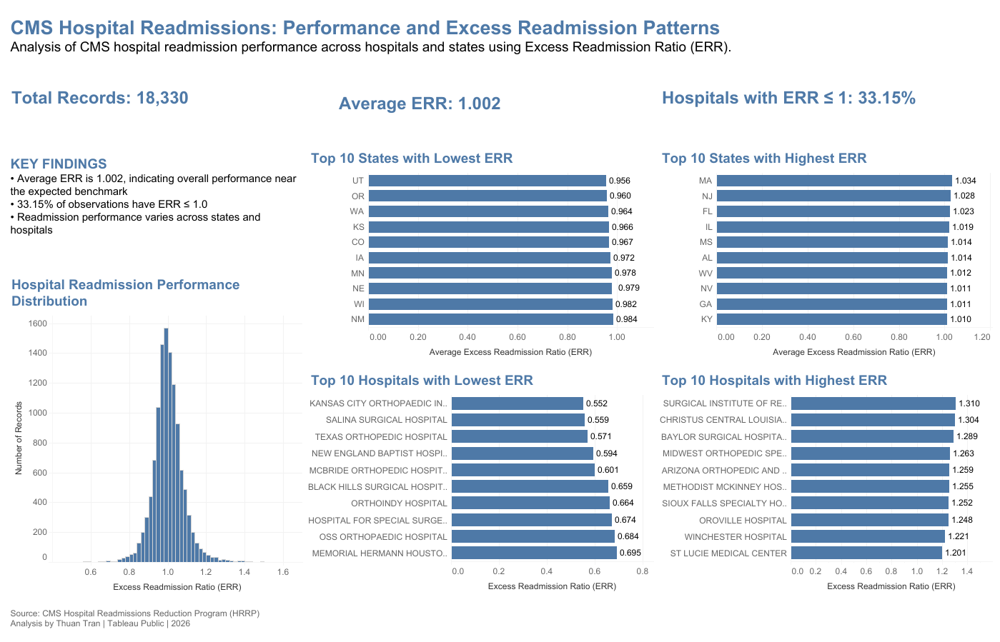

# CMS Hospital Readmissions Analysis

*Healthcare analytics project using Python, Pandas, and Tableau to
analyze hospital readmission performance across U.S. hospitals and
states using the CMS Hospital Readmissions Reduction Program (HRRP)
dataset.*



## Executive Summary

This project analyzes hospital readmission performance using CMS
Hospital Readmissions Reduction Program (HRRP) data.

The analysis focuses on the **Excess Readmission Ratio (ERR)** to
examine variation in readmission performance across hospitals and
states, identify organizations with relatively high or low ERR values,
and provide an interactive view of national readmission patterns.

An ERR near **1.0** indicates performance close to the expected level,
while values above or below 1.0 indicate higher or lower readmissions
relative to the expected benchmark.

## Key Findings

-   The dataset contains **18,330 hospital-condition records**.
-   The average Excess Readmission Ratio is **1.002**, indicating
    overall performance close to the expected benchmark.
-   **33.15% of observations with available ERR values have ERR ≤ 1.0**.
-   ERR values are concentrated around **1.0**, while a smaller number
    of observations appear at the lower and upper ends of the
    distribution.
-   Readmission performance varies across states and hospitals.
-   State- and hospital-level rankings highlight organizations and
    geographic areas with relatively low or high ERR values.

## Interactive Dashboard

Explore the interactive Tableau dashboard:

[View CMS Hospital Readmissions
Dashboard](https://public.tableau.com/app/profile/thuan.tran6584/viz/HospitalReadmissionsAnalysis_17842312183050/HospitalReadmissionsAnalysis)

The dashboard includes:

-   Total record count
-   Average Excess Readmission Ratio
-   Percentage of observations with ERR ≤ 1.0
-   ERR distribution
-   States with the lowest and highest average ERR
-   Hospitals with the lowest and highest ERR

## Data Sources

**Source:** CMS Hospital Readmissions Reduction Program (HRRP)

Project files include:

-   Raw dataset: `data/raw/hospital_readmissions.csv`
-   CMS data dictionary: `data/raw/HOSPITAL_Data_Dictionary.pdf`
-   Processed analytical datasets: `data/processed/`

## Methodology

### 1. Data Preparation

The raw CMS hospital readmissions dataset was reviewed and prepared for
analysis using Python and Pandas.

Key preparation steps included:

-   Reviewing dataset structure and variable types
-   Handling missing and unavailable ERR values
-   Reviewing CMS footnote indicators
-   Creating cleaned analytical data for downstream analysis

### 2. Exploratory Data Analysis

Exploratory analysis was performed to examine:

-   Distribution of Excess Readmission Ratios
-   State-level differences in average ERR
-   Hospital-level variation in ERR
-   Observations at the lower and upper ends of the ERR distribution

### 3. Feature Engineering

A binary analytical flag was created to identify observations with:

`ERR ≤ 1.0`

This measure supports the dashboard KPI showing the percentage of
observations at or below the expected readmission benchmark.

### 4. Hospital and State Comparisons

Processed datasets were generated for:

-   Hospitals with the lowest ERR
-   Hospitals with the highest ERR
-   States with the lowest average ERR
-   States with the highest average ERR

These datasets support the comparative visualizations in Tableau.

### 5. Data Visualization

The final Tableau dashboard combines:

-   KPI indicators
-   ERR distribution histogram
-   State-level rankings
-   Hospital-level rankings
-   Interactive tooltips

## Project Structure

``` text
cms-hospital-readmissions-analysis/
│
├── data/
│   ├── raw/
│   │   ├── hospital_readmissions.csv
│   │   └── HOSPITAL_Data_Dictionary.pdf
│   │
│   └── processed/
│       ├── hospital_readmissions_clean.csv
│       ├── best_hospitals.csv
│       ├── worst_hospitals.csv
│       ├── best_states.csv
│       └── worst_states.csv
│
├── notebooks/
│   └── hospital_readmissions_eda.ipynb
│
├── screenshots/
│   └── dashboard.png
│
├── sql/
│
├── tableau/
│   └── Hospital Readmissions Analysis.twbx
│
└── README.md
```

## Tools and Technologies

-   **Python**
-   **Pandas**
-   **Jupyter Notebook**
-   **Tableau Public**
-   **Git / GitHub**

## Skills Demonstrated

-   Healthcare Data Analytics
-   Data Cleaning and Preparation
-   Exploratory Data Analysis (EDA)
-   Healthcare Quality Measurement
-   Hospital Performance Analysis
-   Data Visualization
-   Tableau Dashboard Development
-   Analytical Communication

## Dashboard Preview

The dashboard presents hospital readmission performance through national
KPIs, ERR distribution, state comparisons, and hospital-level rankings.


------------------------------------------------------------------------

**Analysis by Thuan Tran \| Tableau Public \| 2026**
